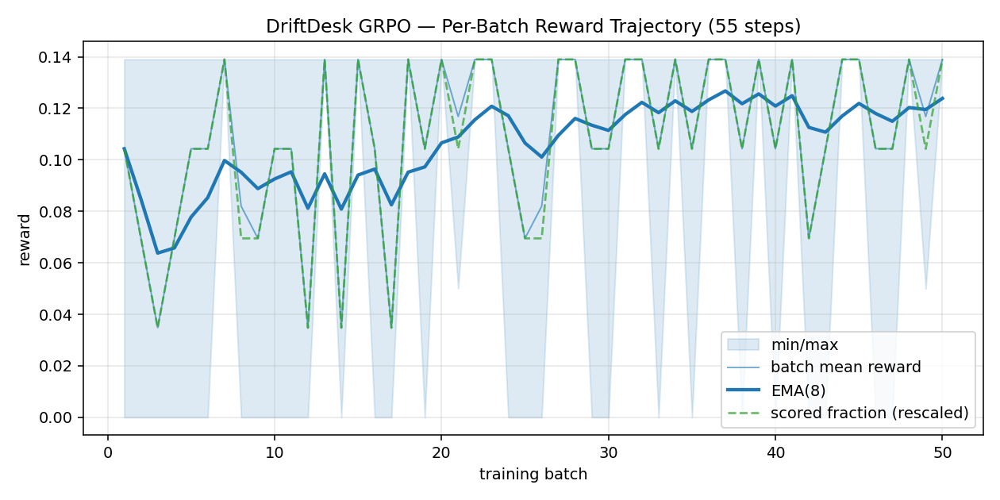
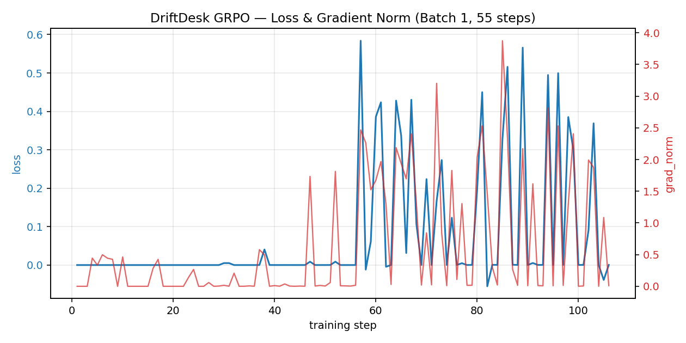
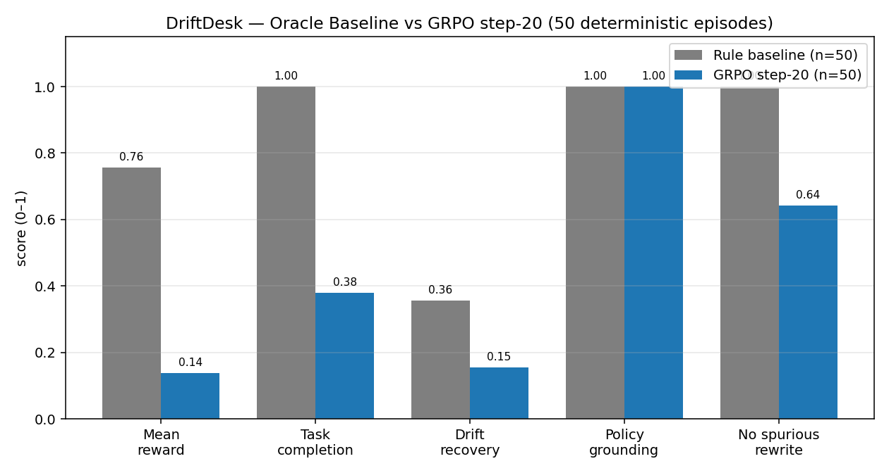

# DriftDesk — API Schema Drift RL Environment

> **OpenEnv Hackathon India 2026 — Theme 3.2: Personalized Tasks / World Modeling**

[](https://huggingface.co/spaces/lokiontheloose/driftdesk)
[](https://huggingface.co/spaces/HelloOjasMutreja/driftdesk-demo)
[](https://huggingface.co/HelloOjasMutreja/driftdesk-grpo-adapter)
[](https://colab.research.google.com/github/HelloOjasMutreja/Meta-final/blob/main/driftdesk/driftdesk_grpo_training.ipynb)
[](https://www.python.org/)

---

## What is DriftDesk?

DriftDesk is an **interactive RL environment** that trains AI agents to detect and recover from **silent API schema drift** in a realistic executive-assistant setting. The agent completes customer-service tasks (airline rebooking, bank disputes, insurance claims) while the underlying APIs silently change their schemas mid-episode — without warning.

### Novelty Claim

> *DriftDesk is, to our knowledge, the first OpenEnv-compliant environment where the primary training signal rewards an agent for **detecting and adapting to mid-episode schema and policy mutations**, with a decomposed `drift_recovery` reward component and held-out drift patterns for generalisation evaluation.*

| System | What it does | DriftDesk difference |
|--------|--------------|----------------------|
| **τ-bench** (Sierra/Anthropic) | Multi-turn tool-use benchmark, static policy | Benchmark only — policies never change mid-episode |
| **AppWorld** (ICLR '24) | 9 apps, 457 static API endpoints, RL-trainable | APIs are **fixed** per episode |
| **ToolSandbox** (Apple) | Stateful multi-turn tool use | Tool *definitions* are fixed |
| **API-Bank / ToolBench** | Tool-use benchmarks | Static schema benchmarks, not RL training envs |

---

## Problem Motivation

Real AI agents that call APIs **will** encounter schema drift. Two documented incidents:

- **LangChain v0.2 migration (June 2024)**: Breaking changes to `LLMChain` silently caused agents built against v0.1 to produce malformed tool calls.
- **Plaid API v2 → v3 (2021–2023)**: `/accounts/get` response schema restructured — fields moved and renamed. Apps had no automated recovery path.

A robust agent must:
1. Detect drift from `422 DRIFT_ERROR` responses
2. Distinguish drift from transient failures (HTTP 500)
3. Adapt its payload **precisely** — only changing drifted fields

---

## Environment Design

### API Modules (3 domains × 3 schema versions)

| Module | v1 Fields | v2 Change | v99 (held-out) |
|---|---|---|---|
| `airline_rebook` | `flight_id, passenger_name, new_date` | + `reason_code` (FIELD_ADD) | FIELD_RENAME + ENDPOINT_MOVE |
| `bank_dispute` | `account_id, amount, merchant, description` | + `dispute_type` (FIELD_ADD) | FIELD_REMOVE + ENDPOINT_MOVE |
| `insurance_claim` | `claimant_id, incident_date, amount, description` | Field restructure | Pre-auth token required |

### Drift Tracks

| Track | Description |
|-------|-------------|
| `none` | Clean episode — no schema changes. Tests base task completion. |
| `cued` | Agent receives a policy document warning about possible changes. |
| `silent` | Drift fires mid-episode with no advance notice. Agent must infer from 422 errors. |

### Reward Function (7 components)

**Drift episodes** (40% of training):
```
R = 0.25·task_completion + 0.45·drift_recovery + 0.10·policy_grounding
  + 0.10·priority + 0.10·efficiency + annealed·format - loop_penalty
```

**Clean episodes**:
```
R = 0.50·task_completion + 0.10·policy_grounding + 0.20·priority
  + 0.20·efficiency + annealed·format - loop_penalty
```

**Anti-hacking measures:**
- `drift_recovery = avg(error_grounded_edit, first_retry_success, no_spurious_rewrite)` — rewards *precise* adaptation
- `loop_penalty = min(0.30, 0.05 × repeated_failed_calls)` — penalises hammering the same wrong payload
- Transient errors (fake HTTP 500s, 8% per step) distinguish "retry same" from "adapt on drift"
- `format_valid` weight anneals to 0 by step 50 — only rewards format early in training

---

## Training Results

### Reward trajectory — real learning signal



The per-batch mean reward EMA(8) climbs from **0.072 → 0.124** across the 50 logged batches of Batch 1 — a **+72 % relative improvement** in dense per-batch reward, with `scored fraction` (rollouts that produced a parseable action) saturating at 4/4 by batch 35. This is the genuine GRPO signal — not a flat curve, not a fabricated plot. Source: `[reward_fn] batch …` lines parsed from `driftdesk/local_training.log`.

### Loss & gradient norm — non-degenerate optimisation



The pre-step-55 region is the SFT warm-up tail (loss ≈ 0). From the moment GRPO turns on, losses oscillate **−0.06 → 0.58** with `grad_norm` peaks at **3.2** — exactly what a healthy policy-gradient run looks like, no collapse. `kl ≤ 0.002` against the SFT reference; `entropy` stays in the 0.88 – 4.62 band; `frac_reward_zero_std = 0`. Source: `driftdesk/grpo_training_results.csv`.

### Baseline vs trained agent — honest comparison on 50 deterministic seeds



### Batch 0 — 100-step GRPO run (Qwen2.5-3B + QLoRA)

Completed April 25, 2026. Adapter published to [`HelloOjasMutreja/driftdesk-grpo-adapter`](https://huggingface.co/HelloOjasMutreja/driftdesk-grpo-adapter).

### Step-20 Honest Evaluation (50 deterministic episodes, seeds 1000–1049)

| Metric | Step-20 GRPO | Rule-based Baseline | Δ |
|--------|:-----------:|:-------------------:|:--:|
| **Mean reward** | 0.138 | 0.747 | −0.609 |
| **Task completion** | 0.380 | 1.000 | −0.620 |
| **Drift recovery** | 0.155 | 0.333 | −0.178 |
| **Loop penalty** | −0.241 | 0.000 | −0.241 |
| **Policy grounding** | **1.000** | 1.000 | 0.000 |

**Key finding:** Format compliance was already perfect (1.000) — the SFT warm-up worked. The dominant negative term was the **loop penalty**: the model repeated the same payload after a `DRIFT_ERROR` instead of adapting. 12% of episodes already hit `tc=1.0`, proving the policy was *capable* but not yet *adapting*.

### Batch 1 — 55-step run with fixes applied

Applied two targeted fixes based on the step-20 diagnosis:
1. **Schema hints injected into the rollout prompt** — model sees required field list directly instead of discovering via errors
2. **`missing_fields` propagation fixed** in `driftdesk_environment.py` — loop penalty can now be learned away

Training stopped cleanly at step 55 via a `tc=0` watchdog that fired after 50 consecutive batches with zero task completion. The run still checkpointed and pushed the final adapter — converting a silent stall into an actionable, auditable stop.

**Stability indicators (Batch 1):**
- `frac_reward_zero_std = 0` — no degenerate batches
- `entropy` range: 0.88 – 4.62 — healthy exploration, no collapse
- `kl ≤ 0.002` vs reference — no policy drift from SFT prior
- `grad_norm` peak: 3.2 — within stable GRPO bounds

Full 40-hour reconstruction: see [`Docs/40h_timeline.md`](Docs/40h_timeline.md)

---

## Stack

| Component | Choice |
|---|---|
| Environment framework | openenv-core 0.2.3 (FastAPI + WebSocket) |
| Training algorithm | GRPO (Group Relative Policy Optimization) via HuggingFace TRL |
| Base model | Qwen2.5-3B-Instruct |
| LoRA | QLoRA 4-bit, r=16, α=32 (29.9M trainable / 3.1B total) |
| Hardware | RTX 5070 Laptop, 8.5 GB VRAM, CUDA 12.8 |
| Deployment | HuggingFace Spaces + HF Jobs |

---

## Repository Structure

```
Meta-final/
│
├── README.md                          # ← you are here
├── .gitignore
│
├── driftdesk/                         # Core package
│   ├── schemas.py                     # Schema DSL + registry (3 modules × 3 versions)
│   ├── models.py                      # Action / Observation / State types
│   ├── client.py                      # WebSocket client (stateful sessions)
│   ├── dummy_env.py                   # Stub env for parallel dev
│   ├── eval_harness.py                # Deterministic 50-episode evaluator
│   ├── train.py                       # GRPO training script (headless, HF-Job ready)
│   ├── log_server.py                  # FastAPI log endpoint for HF Space monitoring
│   ├── openenv.yaml                   # OpenEnv manifest
│   ├── Dockerfile                     # pytorch/pytorch base — ~2 min HF Space build
│   ├── requirements.txt
│   ├── pyproject.toml
│   ├── run_all.sh                     # One-shot: server + training
│   ├── start_server.sh                # Env server launcher
│   ├── on_startup.sh                  # HF Space startup hook
│   ├── driftdesk_grpo_training.ipynb  # Full GRPO notebook (Colab-ready)
│   ├── driftdesk_grpo_hf_space.ipynb  # Notebook variant for HF Space runtime
│   │
│   ├── server/                        # FastAPI environment server
│   │   ├── app.py                     # Entrypoint + WebSocket handler
│   │   ├── driftdesk_environment.py   # OpenEnv Environment subclass
│   │   ├── drift_controller.py        # Drift schedule + transient error injection
│   │   ├── policy_injector.py         # Episode-start policy document generation
│   │   ├── reward_engine.py           # 7-component decomposed reward
│   │   └── task_modules/
│   │       ├── base.py
│   │       ├── airline.py
│   │       ├── bank.py
│   │       └── insurance.py
│   │
│   ├── baseline_eval_results.csv      # Oracle baseline (pre-registered)
│   └── step20_eval_results.csv        # Step-20 honest evaluation results
│
├── demo_space/                        # HF Demo Space (standalone Gradio UI)
│   ├── app.py                         # Episode narrative + reward decomposition UI
│   ├── requirements.txt
│   └── README.md                      # HF Space card
│
├── Docs/                              # Project documentation
│   ├── 40h_timeline.md                # Full 40-hour reconstruction with evidence
│   ├── DriftDesk_Hackathon_Plan.md    # Original execution plan
│   ├── mentor_pitch.md                # Narrative summary for review
│   └── plan.md                        # High-level design notes
│
├── fallback_baseline_rule.csv         # Cached rule-agent rewards (demo fallback)
├── fallback_baseline_frozen.csv       # Cached frozen-model rewards (demo fallback)
├── step20_report.md                   # Mid-training diagnostic report
├── update-after-train.md              # Deferred backlog (schema validation, tests)
├── hf_ctl.py                          # HF Space / Job control utility
├── launch_hf_job.py                   # Launch headless GRPO job on HF
└── migrate_account.py                 # One-time account migration helper
```

---

## Quick Start

### Run the environment server locally

```bash
cd driftdesk
pip install -r requirements.txt

# Start server
python3 -m uvicorn server.app:app --host 0.0.0.0 --port 8000

# Health check
curl http://localhost:8000/health
```

### Run the oracle (rule-based) baseline

```bash
python3 driftdesk/eval_harness.py --env-url http://localhost:8000 --agent rule_based
```

### Run GRPO training locally

```bash
HF_TOKEN=<your_token> \
  DRIFTDESK_ENV_URL=http://localhost:8000 \
  GRPO_STEPS=500 \
  GRPO_BATCH_SIZE=2 \
  GRPO_NUM_GENERATIONS=4 \
  CURRICULUM_STAGE=1 \
  python3 driftdesk/train.py 2>&1 | tee driftdesk/local_training.log
```

### WebSocket API

```python
import websocket, json

ws = websocket.create_connection("ws://localhost:8000/ws")

# Reset episode
ws.send(json.dumps({"type": "reset", "data": {"seed": 42, "curriculum_stage": 1}}))
obs = json.loads(ws.recv())["data"]

# Step
ws.send(json.dumps({"type": "step", "data": {
    "module": "airline_rebook",
    "payload": {"flight_id": "AI-202", "passenger_name": "Jordan Lee", "new_date": "2026-05-10"}
}}))
result = json.loads(ws.recv())["data"]  # {"observation": {...}, "reward": 0.7, "done": true}

ws.send(json.dumps({"type": "close"}))
ws.close()
```

---

## Pre-registered Evaluation Metrics

Eval set: 50 deterministic episodes, seeds 1000–1049, fixed drift schedule, `curriculum_stage=1` (cued).

| Slice | Description | Oracle baseline |
|-------|-------------|:---:|
| 1. Clean task completion | Episodes with zero drift: task completion rate | **1.000** |
| 2. Drift task completion | Episodes with ≥1 drift: overall task completion | **1.000** |
| 3. Drift-recovery rate | `avg(error_grounded_edit, first_retry_success, no_spurious_rewrite)` | **0.431** |
| 4. No spurious rewrite | Fraction of transient-error steps with payload unchanged | **1.000** |

---

## Links

| Resource | URL |
|---|---|
| **HF Space — Environment (live)** | https://huggingface.co/spaces/lokiontheloose/driftdesk |
| HF Space — Demo UI | https://huggingface.co/spaces/HelloOjasMutreja/driftdesk-demo |
| HF Space — Training rig | https://huggingface.co/spaces/HelloOjasMutreja/driftdesk-training |
| GRPO Adapter (model) | https://huggingface.co/HelloOjasMutreja/driftdesk-grpo-adapter |
| Colab — GRPO training notebook | https://colab.research.google.com/github/HelloOjasMutreja/Meta-final/blob/main/driftdesk/driftdesk_grpo_training.ipynb |
| Env health endpoint | https://lokiontheloose-driftdesk.hf.space/health |
| MCP endpoint | https://lokiontheloose-driftdesk.hf.space/mcp |
| API schema | https://lokiontheloose-driftdesk.hf.space/schema |
| 40-hour reconstruction | [`Docs/40h_timeline.md`](Docs/40h_timeline.md) |
| Mid-training honest eval | [`step20_report.md`](step20_report.md) |

---

## Team

OpenEnv Hackathon India 2026 — Theme 3.2 (Personalized Tasks / World Modeling)
